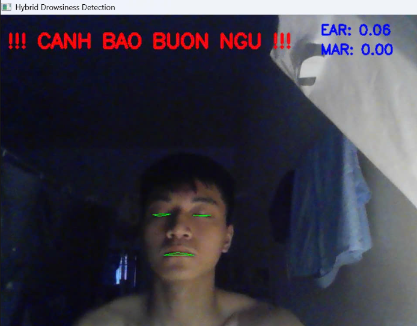
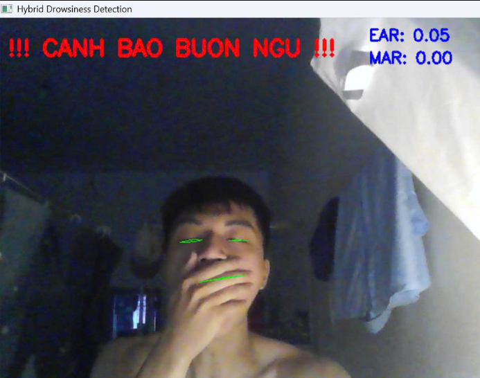
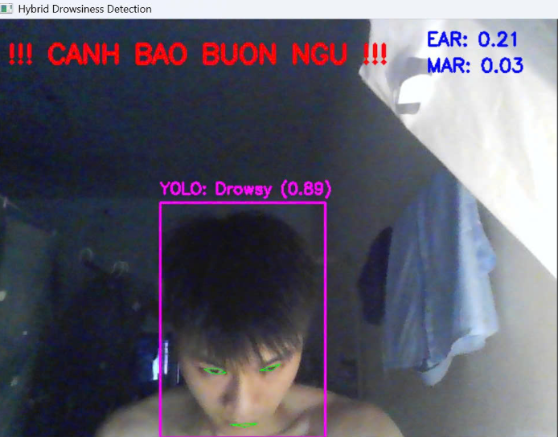

# Hệ thống Phát hiện Buồn ngủ cho Lái xe (Hybrid Drowsiness Detection System)

Dự án này giúp phát hiện trạng thái buồn ngủ của tài xế trong thời gian thực bằng cách sử dụng phương pháp kết hợp (hybrid):
- **Phân tích điểm mốc khuôn mặt** với MediaPipe (tính toán chỉ số EAR, MAR).
- **Phát hiện hành vi** qua mô hình YOLOv8.

Hệ thống sẽ đưa ra cảnh báo khi phát hiện các dấu hiệu buồn ngủ như nhắm mắt, ngáp hoặc gật gù.

---

## ✨ Tính năng chính

- **Phát hiện nhắm mắt:** Sử dụng chỉ số **EAR (Eye Aspect Ratio)** để xác định khi mắt nhắm trong thời gian dài.
- **Phát hiện ngáp:** Sử dụng chỉ số **MAR (Mouth Aspect Ratio)** để nhận diện hành vi ngáp.
- **Phát hiện gật gù:** Sử dụng **YOLOv8** để phát hiện tư thế cúi đầu, gật gù đặc trưng của người buồn ngủ.
- **Cảnh báo thời gian thực:** Phát âm thanh hoặc hiển thị cảnh báo ngay lập tức khi một trong các dấu hiệu được duy trì đủ lâu.
- **Phương pháp kết hợp:** Tăng độ chính xác và giảm cảnh báo sai bằng cách kết hợp nhiều phương pháp.

## 📸 Demo

| Nhắm mắt (EAR) | Ngáp ngủ (MAR) | Gật gù (YOLOv8) |
| :---: |:---:|:---:|
|  |  |  |


## 🛠️ Công nghệ & Phương pháp

Hệ thống sử dụng một cách tiếp cận hybrid để đảm bảo độ tin cậy.

### 1. MediaPipe (EAR & MAR)
- **EAR (Eye Aspect Ratio):** Đo lường tỷ lệ giữa chiều dọc và chiều ngang của mắt. Một giá trị EAR thấp cho thấy mắt đang nhắm.
  - _Ưu điểm:_ Nhẹ, nhanh, hoạt động hiệu quả trong điều kiện đủ sáng.
  - _Nhược điểm:_ Nhạy cảm với góc quay của đầu và điều kiện ánh sáng yếu.
- **MAR (Mouth Aspect Ratio):** Đo lường tỷ lệ giữa chiều dọc và chiều ngang của miệng để phát hiện hành vi ngáp.

### 2. YOLOv8
- Mô hình được huấn luyện trên tập dữ liệu về các hành vi của tài xế khi buồn ngủ (nghiêng đầu, cúi gằm mặt, v.v.).
- **Phát hiện tư thế tổng thể**, không chỉ dựa vào đặc điểm khuôn mặt.
  - _Ưu điểm:_ Hoạt động tốt ở nhiều góc độ khác nhau, có khả năng chống chịu tốt hơn nếu một phần khuôn mặt bị che khuất.
  - _Nhược điểm:_ Yêu cầu phần cứng mạnh hơn MediaPipe.

### 🧠 Logic Cảnh báo
Hệ thống sẽ kích hoạt cảnh báo `!!! CANH BAO BUON NGU !!!` khi bất kỳ điều kiện nào dưới đây được duy trì liên tục:

| Phương pháp | Mô tả | Ngưỡng (Threshold) | Số khung hình liên tiếp (Frames) |
| :--- | :--- | :--- | :--- |
| **EAR** | Phát hiện mắt nhắm | `< 0.22` | `≥ 10` |
| **MAR** | Phát hiện ngáp | `> 0.5` | `≥ 14` |
| **YOLOv8** | Phát hiện tư thế "drowsy" | `Confidence > 0.7` | `≥ 10` |

## 🚀 Cài đặt & Chạy dự án

### 1. Clone repository
```bash
git clone https://github.com/Huyzilla/Drowsiness_Detection
cd drowsiness-detection
```

### 2. Cài đặt các thư viện cần thiết
```bash
pip install -r requirements.txt
```

### 3. Chạy ứng dụng
```bash
python hybrid_detect.py
```

## 📂 Cấu trúc thư mục
```
drowsiness-detection/
├── hybrid_detect.py        
├── yolo_test.py            
├── best.pt                 
├── config.yaml    
├── requirements.txt
├── README.md
└── images/
    ├── nham_mat.png
    ├── ngap_ngu.png
    └── gat_gu.png
```

## 📦 Dataset
Mô hình YOLOv8 được huấn luyện bằng tập dữ liệu đã được gán nhãn từ Roboflow.
- **Link dataset:** [Drowsiness Detection Dataset](https://app.roboflow.com/tran-quang-huy-9vmds/drowsiness-detection-cntmz-vq01w/models) 

